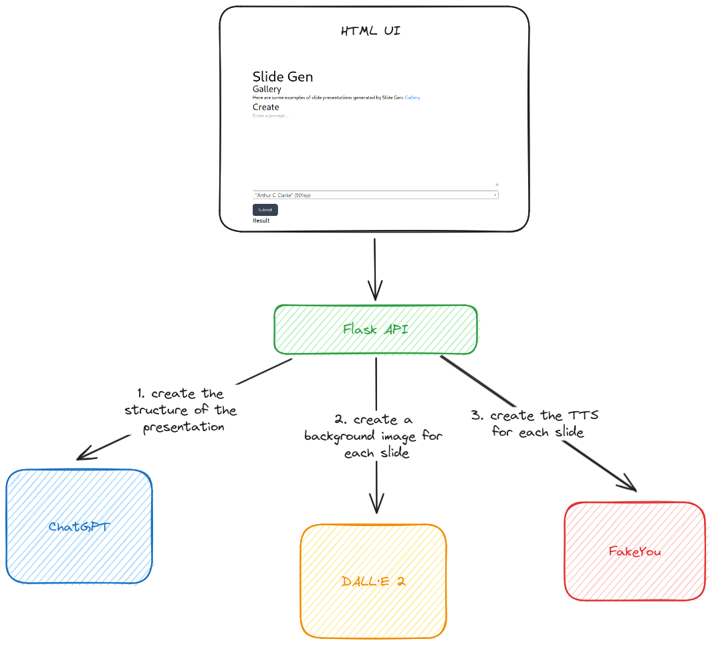

# Slide Gen

> Create a short presentation from a prompt.

Web tool that can be used to generate a video using ChatGPT, DALLE-2 and
FakeYou.

### Quickstart

You can easily run the web application with Docker and access it at
`localhost:5000`. You will need to add an environment variable for the
`OPENAI_API_KEY`. To use better FakeYou queue you need to define
`FAKEYOU_USERNAME` and `FAKEYOU_PASSWORD`. However these are paid services.

```console
export OPENAI_API_KEY=sk-...
export FAKEYOU_USERNAME=...
export FAKEYOU_PASSWORD=...
make docker-run
```

### Workflow



The UI of the application allows the user to create a prompt for the
presentation and to change the voice for the TTS. The API of the application
will use ChatGPT to generate the structure of the presentation. This will be
done using a special system prompt on top of the prompt that the user provided.

The system prompt can be found here
<https://github.com/alexjercan/slide-gpt/blob/master/slide_gpt/main.py#L22>.
This will setup ChatGPT to respond in a JSON format. The prompt will also show
an example for a presentation. The expected result is a JSON list that contains
objects with "text" and "image" keys. The text will be used for the voice and
the image will be used as the background of the slide.

After the presentation structure is generated, and we have obtained the JSON
array, we begin generating the images and the TTS. To generate images we use
the DALL·E 2 model from openai. To generate the voice of the presentation we
use the FakeYou service.

Finally, we will have all the materials to assemble the presentation. To
concatenate all the files together we use ffmpeg.

The result will be an MP4 video that contains the images generated with DALL·E
2, the audio generated with FakeYou and the subtitles of the script generated
by ChatGPT.
